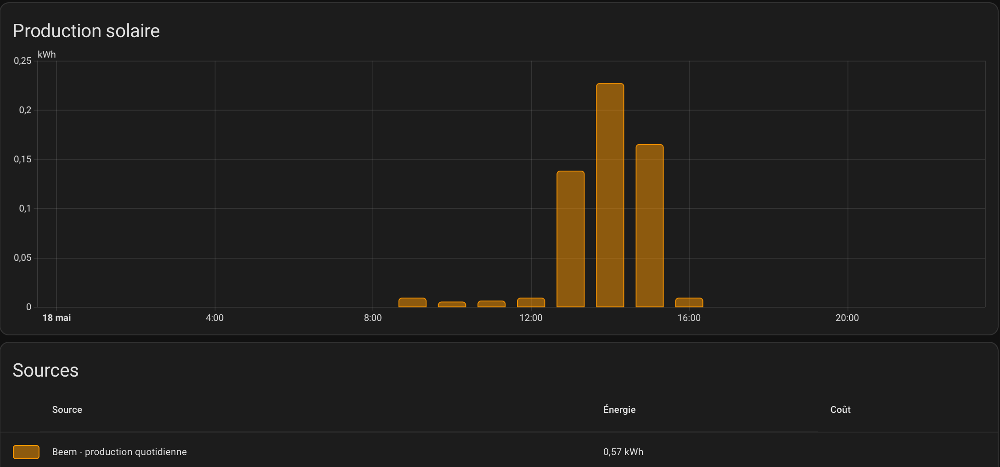

<!-- PROJECT LOGO --> 
<br />
<div align="center">
  <a href="https://github.com/ClaraVnk/home-assistant-beem-energy">
    
  </a>

  <h3 align="center">Beem Energy integration in Home Assitant energy Dashboard !</h3>
</div>

### Built With

* 

<!-- GETTING STARTED -->
## GETTING STARTED

### 1. Create a beem.yaml file

Create a new file named beem.yaml in the main folder of your Home Assistant's configuration.

  ```sh
 template:
- sensor:
  - name: "Beem - post Data"
    unique_id: beeem_post_data
    state: '{"month":{{now().strftime("%m").lstrip("0")}},"year":{{now().strftime("%Y")}}}'
  - name: "Beem - production mensuelle"
    unique_id: beem_total_month
    unit_of_measurement: "kWh"
    device_class: energy
    state_class: total_increasing
    state: "{{ state_attr('sensor.beem','totalMonth') | float/1000 }}"
    icon: mdi:solar-power
  - name: "Beem - production quotidienne"
    unique_id: beem_total_day
    unit_of_measurement: "kWh"
    device_class: energy
    state_class: total_increasing
    state: "{{ state_attr('sensor.beem','totalDay') | float/1000 }}"
    icon: mdi:solar-power
  - name: "Beem - production instantanée"
    unique_id: beem_watt_production
    unit_of_measurement: "W"
    device_class: power
    state: "{{ state_attr('sensor.beem','wattHour') }}"
    icon: mdi:solar-power


rest:
  - resource_template: https://api-x.beem.energy/beemapp/box/summary 
    method: POST
    headers:
      Content-type: application/json
      Authorization: !secret beem_token
    payload_template: >
      {
        "month": {{ now().month }},
        "year": {{ now().year }}
      }
    scan_interval: 60
    sensor:
      - name: "beem"
        json_attributes_path: "$[0]"
        json_attributes:
          - "totalMonth"
          - "wattHour"
          - "totalDay"
        value_template: 'OK'

command_line:
   - sensor:
       command: 'token=$(curl https://api-x.beem.energy/beemapp/user/login -X POST -H "Content-Type: application/json" --data-raw "{\"email\":\"YOUR_BEEM_EMAIL\",\"password\":\"YOUR_PASSWORD\"}" | jq .accessToken) && token=${token//\"} && echo $token && sed -i "s/\(beem_token:\)\(.*\)/\1 Bearer $token/" /config/secrets.yaml'
       name: beem_token
       scan_interval: 84600

shell_command:
  beem: sed -i "s/\({{cmd}}:\)\(.*\)/\1 '{{ states.sensor.post_data.state|to_json }}'/" /config/configuration.yaml
  ```

🚨 Modify the line 51 with your email and password from your Beem Energy account.

### 2. Modify your configuration.yaml file

Add this lines to your configuration.yaml file : 

  ```sh
homeassistant:
  packages:
    beem: !include beem.yaml
  ```

🚨 Do not create a new line "home assistant" or "packages" if they already exist, just add the beem package.

### 3. Curl your token

Open a terminal and type :

 ```sh
curl https://api-x.beem.energy/beemapp/user/login -X POST -H "Content-Type: application/json" --data-raw '{"email":"YOUR_EMAIL","password":"YOUR_PASSWORD"}'
  ```

Copy the token : "accessToken":"YOUR_ACCESS_TOKEN"

In the file secrets.yaml add the lines for your token : 

  ```sh
beem_token : Bearer YOUR_TOKEN_ACCESS
  ```

<!-- USAGE EXAMPLES -->
## Usage

  <a href="https://github.com/ClaraVnk/home-assistant-beem-energy">
    
  </a>

<!-- CONTRIBUTING -->
## Contributing

Contributions are what make the open source community such an amazing place to learn, inspire, and create. Any contributions you make are **greatly appreciated**.

If you have a suggestion that would make this better, please fork the repo and create a pull request. You can also simply open an issue with the tag "enhancement".
Don't forget to give the project a star! Thanks again!

<!-- ACKNOWLEDGMENTS -->
## Acknowledgments

This is based on @nicolinuxfr 's work (available on Gitlab https://gitlab.macg.io/-/snippets/34)
